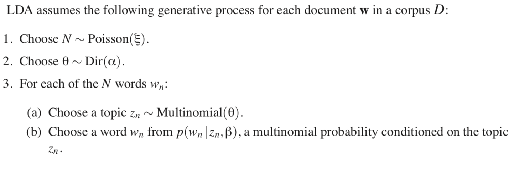
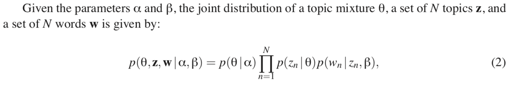

Title:
Date: 2018-10-29 22:00
Author: Will Wolf
Lang: en
Slug: additional-strategies-partition-function
Status: published
Summary:
Image: figures/em-for-lda/.png

Consider a model with parameters $\theta$ and latent variables $\mathbf{Z}$; the expectation-maximization algorithm (EM) is a mechanism for computing the values of $\theta$ that, under this model, maximize the likelihood of some observed data $\mathbf{X}$.

The joint probability of our model can be written as follows:

$$
p(\mathbf{X}, \mathbf{Z}\vert \theta) = p(\mathbf{X}\vert \mathbf{Z}, \theta)p(\mathbf{Z}\vert \theta)
$$

where, once more, our stated goal is to maximize the marginal likelihood of our data:

$$
\log{p(\mathbf{X}\vert\theta)} = \log{\sum_{\mathbf{Z}}p(\mathbf{X, Z}\vert\theta)}
$$

An example of a latent variable model is the Latent Dirichlet Allocation[^1] model for which we shall derivation the EM equations once finished with the general case.

## Why not maximum likelihood estimation?

As the adage goes, computing the MLE with respect to this marginal is "hard." I loosely understand why. Irrespective, Bishop[^2] states:

> A key observation is that the summation over the latent variables appears inside the logarithm. Even if the joint distribution $p(\mathbf{X, Z}\vert\theta)$ belongs to the exponential family, the marginal distribution $p(\mathbf{X}\vert\theta)$ typically does not as a result of this summation. The presence of the sum prevents the logarithm from acting directly on the joint distribution, resulting in complicated expressions for the maximum likelihood solution.

**We'll want something else to maximize instead.**

## A lower bound

Instead of maximizing the log-marginal $\log{p(\mathbf{X}\vert\theta)}$, let's maximize a lower-bound with a less-problematic form.

One candidate for this form is $\log{p(\mathbf{X}, \mathbf{Z}\vert \theta)}$ which, almost tautologically, removes the summation over latent variables $\mathbf{Z}$.

(delete? This term is also known as the "complete-data log likelihood," i.e. the log-likelihood were we to *observe* both the data *as well as* latent variables.)

As such, let's derive a lower-bound which features this term. As $\log{p(\mathbf{X}\vert\theta)}$ is often called the "evidence," we'll call our expression the "evidence lower-bound" (ELBO).

## Jensen's inequality 

$$
\begin{align*}
\log{p(\mathbf{X}\vert\theta)}
&= \log{\sum_{\mathbf{Z}}p(\mathbf{X, Z}\vert\theta)}\\
&= \log{\sum_{\mathbf{Z}}q(\mathbf{Z})\frac{p(\mathbf{X, Z}\vert\theta)}{q(\mathbf{Z})}}\\
&= \log{\mathop{\mathbb{E}}_{q(\mathbf{Z})}\bigg[\frac{p(\mathbf{X, Z}\vert\theta)}{q(\mathbf{Z})}}\bigg]\
\end{align*}
$$

## in the convex case, jensen's inequality says that the expectation of a function is greater than the function of the expectation. in concave case, it's the opposite.

$$
\begin{align*}
\log{p(\mathbf{X}\vert\theta)} = \log{\mathop{\mathbb{E}}_{q(\mathbf{Z})}\bigg[\frac{p(\mathbf{X, Z}\vert\theta)}{q(\mathbf{Z})}\bigg]}
&\geq \mathop{\mathbb{E}}_{q(\mathbf{Z})}\bigg[\log{\frac{p(\mathbf{X, Z}\vert\theta)}{q(\mathbf{Z})}}\bigg]\\
= \log{\mathop{\mathbb{E}}_{q(\mathbf{Z})}\bigg[\frac{p(\mathbf{X, Z}\vert\theta)}{q(\mathbf{Z})}\bigg]}
&= \mathop{\mathbb{E}}_{q(\mathbf{Z})}\bigg[\log{\frac{p(\mathbf{X, Z}\vert\theta)}{q(\mathbf{Z})}}\bigg] + R
\end{align*}
$$

# so, what's R?

$$
\begin{align*}
R
&= \log{p(\mathbf{X}\vert\theta)} -  \mathop{\mathbb{E}}_{q(\mathbf{Z})}\bigg[\log{\frac{p(\mathbf{X, Z}\vert\theta)}{q(\mathbf{Z})}}\bigg]\\
&= \log{p(\mathbf{X}\vert\theta)} -  \sum_{\mathbf{Z}}q(\mathbf{Z})\log{\frac{p(\mathbf{X, Z}\vert\theta)}{q(\mathbf{Z})}}
\end{align*}
$$

# as an aside

$$
\begin{align*}
p(\mathbf{Z}\vert\mathbf{X}, \theta) &= \frac{p(\mathbf{X}, \mathbf{Z}\vert\theta)}{p(\mathbf{X}\vert\theta)}\\
\log{p(\mathbf{Z}\vert\mathbf{X}, \theta)}
&= \log{p(\mathbf{X}, \mathbf{Z}\vert\theta)} - \log{p(\mathbf{X}\vert\theta)}\\
\log{p(\mathbf{X}, \mathbf{Z}\vert\theta)} &= \log{p(\mathbf{Z}\vert\mathbf{X}, \theta)} + \log{p(\mathbf{X}\vert\theta)}
\end{align*}
$$

# continuing

$$
\begin{align*}
R
&= \log{p(\mathbf{X}\vert\theta)} -  \sum_{\mathbf{Z}}q(\mathbf{Z})\log{\frac{p(\mathbf{X, Z}\vert\theta)}{q(\mathbf{Z})}}\\
&= \log{p(\mathbf{X}\vert\theta)} -  \sum_{\mathbf{Z}}q(\mathbf{Z})\bigg(\log{p(\mathbf{X, Z}\vert\theta) - \log{q(\mathbf{Z})}}\bigg)\\
&= \log{p(\mathbf{X}\vert\theta)} -  \sum_{\mathbf{Z}}q(\mathbf{Z})\bigg(\log{p(\mathbf{Z}\vert\mathbf{X}, \theta)} + \log{p(\mathbf{X}\vert\theta)} - \log{q(\mathbf{Z})}\bigg)\\
&= \sum_{\mathbf{Z}}q(\mathbf{Z})\log{p(\mathbf{X}\vert\theta)} -  \sum_{\mathbf{Z}}q(\mathbf{Z})\bigg(\log{p(\mathbf{Z}\vert\mathbf{X}, \theta)} + \log{p(\mathbf{X}\vert\theta)} - \log{q(\mathbf{Z})}\bigg)\\
&= \sum_{\mathbf{Z}}q(\mathbf{Z})\bigg(\log{p(\mathbf{X}\vert\theta)} -  \big(\log{p(\mathbf{Z}\vert\mathbf{X}, \theta)} + \log{p(\mathbf{X}\vert\theta)} - \log{q(\mathbf{Z})}\big)\bigg)\\
&= \sum_{\mathbf{Z}}q(\mathbf{Z})-  \big(\log{p(\mathbf{Z}\vert\mathbf{X}, \theta)} - \log{q(\mathbf{Z})}\big)\\
&=
-\sum_{\mathbf{Z}}q(\mathbf{Z})\log{\frac{p(\mathbf{Z}\vert\mathbf{X}, \theta)}{q(\mathbf{Z})}}\\
&= \text{KL}\big(p(\mathbf{Z}\vert\mathbf{X}, \theta) \Vert q(\mathbf{Z})\big)\\
\end{align*}
$$

# putting this back together

$$
\log{p(\mathbf{X}\vert\theta)}
\geq \mathop{\mathbb{E}}_{q(\mathbf{Z})}\bigg[\log{\frac{p(\mathbf{X, Z}\vert\theta)}{q(\mathbf{Z})}}\bigg] + \text{KL}\big(p(\mathbf{Z}\vert\mathbf{X}, \theta) \Vert q(\mathbf{Z})\big)
$$

# from here, EM is quite simple

# remember, $\log{p(\mathbf{X}\vert\theta)}$ doesn't change as $q(\mathbf{Z})$ changes

# em for lda

Thanks for reading.

## Code
The [repository](https://github.com/cavaunpeu/boltzmann-machines) and [rendered notebook](https://nbviewer.jupyter.org/github/cavaunpeu/boltzmann-machines/blob/master/boltzmann-machines-part-2.ipynb) for this project can be found at their respective links.

## References
[^1]: D.M. Blei, A.Y. Ng, and M.I. Jordan. Latent Dirichlet allocation. JMLR, 3:993–1022, 2003.
[^2]: C. M. Bishop. Pattern recognition and machine learning,
page 229. Springer-Verlag New York, 2006.
