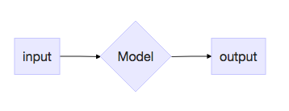

Title: Minimizing the Negative Log-Likelihood, in English
Date: 2017-04-07 10:07
Author: Will Wolf
Lang: en
Slug: minimizing_the_negative_log_likelihood_in_english
Status: draft
Summary:
Image:

change "model" to "estimator"

Roughly speaking, my machine learning journey began on [Kaggle](http://kaggle.com). "There's data, a model and a loss function to optimize," I learned. "Regression models predict continuous-valued real numbers; classification models predict 'red,' 'green,' 'blue.' Typically, the former employs the mean squared error or mean absolute error; the latter, the cross-entropy loss. Stochastic gradient descent updates the model's parameters to drive these losses down." Furthermore, to build these models, just `import sklearn`.

A dexterity with the above is often sufficient for -- at least from a technical stance -- both employment and impact as a data scientist. In industry, commonplace prediction and inference problems -- binary churn, credit scoring, product recommendation and A/B testing, for example -- are easily matched with an off-the-shelf algorithm plus proficient data scientist for a measurable boost to the company's bottom line. In a vacuum I think this is fine: the winning driver does not *need* to know how to build the car. Surely, I've been this driver before.

Once fluid with "scikit-learn fit and predict," I turned to statistics. I was always aware that the two were related, yet figured them ultimately parallel sub-fields of my job. With the former, I build classification models; with the latter, I infer signup rates with the exponential distribution and MCMC -- right?

Before long, I dove deeper into machine learning -- reading textbooks, papers and source code and writing this blog. Therein, I began to come across *terms I didn't understand used to describe the things that I did.* "I understand what the categorical cross-entropy loss is, what it does and how it's defined," for example; **"why are you calling it the negative log-likelihood?"**

Marginally wiser, I now know two truths about the above:
1. Techniques we anoint as "machine learning" - classification and regression models, notably - have their underpinnings almost entirely in statistics. For this reason, terminology can often flow between.
2. None of this stuff is new.

The goal of this post is to take three models we know, love, and know how to use and explain what's really going on underneath the hood. I will assume the reader is familiar with concepts in both machine learning and statistics, and comes in search of a deeper understanding of the connections therein. There will be math -- but only as much as necessary.

When deploying a predictive model in a production setting, it is generally in our best interest to `import sklearn`, i.e. use a model that someone else has built. This is something we already know how to do. As such, this post will start and end here: your head is currently above water; we're going to dive into the pool, touch the bottom, then work our way back to the surface. Lemmas will be written in -> _**bold**_.


First, let's meet our three protagonists. We'll define them in [Keras](https://keras.io/) for the illustrative purpose of a unified and idiomatic API.

## [Linear regression](http://ufldl.stanford.edu/tutorial/supervised/LinearRegression/) with mean squared error

```python
input = Input(shape=(10,))
output = Dense(1)(input)

model = Model(input, output)
model.compile(optimizer=optimizer, loss='mean_squared_error')
```

## [Logistic regression](http://ufldl.stanford.edu/tutorial/supervised/LogisticRegression/) with binary cross-entropy loss
```python
input = Input(shape=(10,))
output = Dense(1, activation='sigmoid')(input)

model = Model(input, output)
model.compile(optimizer=optimizer, loss='binary_crossentropy')
```

## [Softmax regression](http://ufldl.stanford.edu/tutorial/supervised/SoftmaxRegression/) with categorical cross-entropy loss
```python
input = Input(shape=(10,))
output = Dense(3, activation='softmax')(input)

model = Model(input, output)
model.compile(optimizer=optimizer, loss='categorical_crossentropy')
```

Next, we'll select four components key to each: its response variable, its functional form, its loss function and its loss function plus regularization. For each model, we'll describe the statistical underpinnings of each component -- the steps on the ladder towards the surface of the pool.

Before diving in, we'll need to define a few important concepts.

## Random variable
I define a random variable as "a thing that can take on a bunch of different values."
- "The tenure of despotic rulers in Central Africa" is a random variable. It could take on values of 25.73 years, 14.12 years, 8.99 years, ad infinitum; it could not take on values of 1.12 million years, nor -5 years.
- "The height of the next person to leave the supermarket" is a random variable.
- "The color of shirt I wear on Mondays" is a random variable. (Incidentally, this one only has ~3 unique values.)

## Probability distribution
A probability distribution is a lookup table for the likelihood of observing each unique value of a random variable. Assuming a given variable can take on values in $\{\text{rain, snow, sleet, hail}\}$, the following is a valid probability distribution:

```python
p = {'rain': .14, 'snow': .37, 'sleet': .03, 'hail': .46}
```

Trivially, these values must sum to 1.

- A *probability mass function* is a probability distribution for a discrete-valued random variable.
- A *probability density function* _**gives**_ a probability distribution for a continuous-valued random variable.
  - *Gives*, because this function itself is not a lookup table. Given a random variable that takes on values in $[0, 1]$, we do not and cannot define $p(0.01)$, $p(0.001)$, $p(0.0001)$, etc.
  - Instead, we define a function that tells us the probability of observing a value within a certain *range*, i.e. $p(0.01 < X < .4)$.
  - This is the probability density function, where $p(0 \leq X \leq 1) = 1$.

## Entropy
Entropy quantifies the number of ways we can reach a given outcome. Imagine 8 friends are splitting into 2 taxis en route to a Broadway show. Consider the following two scenarios:
  - *4 friends climb into each taxi.* We could accomplish this with the following assignments:

  ```python
  # fill the first, then the second
  assignment_1 = [1, 1, 1, 1, 2, 2, 2, 2]

  # alternate assignments
  assignment_2 = [1, 2, 1, 2, 1, 2, 1, 2]

  # alternate assignments in batches of two
  assignment_1 = [1, 1, 2, 2, 1, 1, 2, 2]

  # etc.
  ```

  - *All friends climb into the first taxi.* There is only one possible assignment.

  ```python
  assignment_1 = [1, 1, 1, 1, 1, 1, 1, 1]
  ```

 (In this case, the Broadway show is probably in [West Africa](http://willtravellife.com/2013/04/how-does-a-west-african-bush-taxi-work/) or a similar part of the world.)

Since there are more ways to reach the first outcome than there are the second, the first outcome has a higher entropy.

### More explicitly
We compute entropy for probability distributions. This computation is given as:

$$
H(p) = -E\log{P_i} = -\sum\limits_{i=1}^{n} p_i \log{p_i}
$$

where:
- There are $n$ unique, possible events.
- Each event $i$ has probability $p_i$.

Entropy is the *weighted-average log probability* over possible events, which measures the *uncertainty inherent in their probability distribution.* The higher the entropy, the less certain we are about the value we're going to get.

Let's calculate the entropy of our distribution above.

```python
p = {'rain': .14, 'snow': .37, 'sleet': .03, 'hail': .46}

def entropy(prob_dist):
    return -sum([ p*log(p) for p in prob_dist.values() ])

In [1]: entropy(p)
Out[1]: 1.1055291211185652
```

For comparison, let's assume two more distributions and calculate their respective entropies.

```python
p_2 = {'rain': .01, 'snow': .37, 'sleet': .03, 'hail': .59}

p_3 = {'rain': .01, 'snow': .01, 'sleet': .03, 'hail': .95}

In [2]: entropy(p_2)
Out[2]: 0.8304250977453105

In [3]: entropy(p_3)
Out[3]: 0.2460287703075343
```

In the first distribution, we are least certain as to what tomorrow's weather will bring. As such, this has the highest entropy. In the third distribution, we are almost certain it's going to hail. As such, this has the lowest entropy.

Finally, it is a probability distribution that dictates the different taxi assignments just above. A distribution for a random variable that has many possible outcomes has a higher entropy than a distribution that gives only one.

Let's dive in. We'll start at the bottom and work our way back to the top.

# Response variable

Roughly speaking, each model looks as follows. It is a diamond that receives an input and produces an output.



The models differ in the type of response variable they predict, i.e. the $y$.
- Linear regression predicts a continuous-valued real number. Let's call it `temperature`.
- Logistic regression predicts a binary label. Let's call it `cat or dog`
- Softmax regression predicts a multi-class label. Let's call it `red or green or blue`.

In each model, the response variable can take on a bunch of different values. In other words, they are *random variables.* Which probability distributions are associated with each?

Unfortunately, we don't know. All we do know, in fact, is the following:
- `temperature` has an underlying true mean $\mu \in (-\infty, \infty)$ and variance $\sigma^2 \in (-\infty, \infty)$.
- `cat or dog` takes on the value `cat` or `dog`. The likelihood of observing each outcome does not change over time, in the same way that $p(\text{heads})$ for a fair coin is always $0.5$.
- `red or green or blue` takes on the value `red` or `green` or `blue`. The likelihood of observing each outcome does not change over time, in the same way that the probability of rolling a given number from fair die is always $\frac{1}{6}$.

For clarity, each one of these assumptions is utterly banal. *Can we use them nonetheless to select probability distributions for our random variables?*

### Maximum entropy distributions
Consider another continuous-valued random variable: "Uber's yearly profit." Like `temperature`, it also has an underlying true mean $\mu \in (-\infty, \infty)$ and variance $\sigma^2 \in (-\infty, \infty)$ Trivially, the respective means and variances will be different. Assume we observe 10 (fictional) values of each that look as follows:

| uber | temperature |
|------|-------------|
| -100 | -50         |
| -80  | 5           |
| -20  | 56          |
| 5    | 65          |
| 15   | 62          |
| -10  | 63          |
| 22   | 60          |
| 12   | 78          |
| 70   | 100         |
| 100  | -43         |

Plotting, we get the following:


We are not given the true underlying probability distribution associated with each random variable -- not its general "shape," nor the parameters that control its general shape. In fact, we will *never* be given these things; the point of statistics is to infer what they are.

To make an initial choice we keep two things in mind:
- *We'd like to be conservative*. We've only seen 10 values of "Uber's yearly profit;" we don't want to discount the fact that the next 20 could fall into $[-60, -50]$ just because they haven't yet been observed.
- *We need to choose the same probability distribution "shape" for both random variables, as we've made identical assumptions for each*.

As such, we'd like the most conservative distribution that obeys its constraints. This is the *maximum entropy distribution*.

For `temperature`, this is the [Gaussian distribution](https://en.wikipedia.org/wiki/Normal_distribution). Its probability density function is given as:

$$
P(y\vert \mu, \sigma^2) = \frac{1}{\sqrt{2\pi\sigma^2}}\exp{\bigg(-\frac{(y - \mu)^2}{2\sigma^2}\bigg)}
$$

For `cat or dog`, this is the [Binomial distribution](https://en.wikipedia.org/wiki/Binomial_distribution). Its probability mass function  (for a single observation) is given as:

$$
p(\text{outcome}) =
\begin{cases}
1 - p & \text{outcome = cat}\\
p & \text{outcome = dog}\\
\end{cases}
$$

For `red or green or blue`, this is the [multinomial distribution](https://en.wikipedia.org/wiki/Multinomial_distribution). Its probability mass function (for a single observation) is given as:

$$
p(\text{outcome}) =
\begin{cases}
p_{\text{red}} & \text{outcome = red}\\
p_{\text{green}} & \text{outcome = green}\\
1 - p_{\text{red}} - p_{\text{green}} & \text{outcome = blue}\\
\end{cases}
$$

While it may seem like we've "waved our hands" over the connection between the stated equality constraints for the response variable of each model and the respective distributions we've selected, it is [Lagrange multipliers](https://en.wikipedia.org/wiki/Lagrange_multiplier) that succinctly and algebraically bridge this gap. This [post](https://www.dsprelated.com/freebooks/sasp/Maximum_Entropy_Property_Gaussian.html) gives a terrific example of this derivation. I've chosen to omit it as I did not feel it would contribute to the clarity nor direction of this post.

Finally, while we do assume that a Gaussian dictates the true distribution of values of both "Uber's yearly profit" and `temperature`, it is, trivially, a different Gaussian for each. This is because each random variable has its own true underlying mean and variance. These values make the respective Gaussians taller or wider -- shifted left or shifted right.

## Functional form
Our three protagonists generate predictions via distinct functions: the [identity function](https://en.wikipedia.org/wiki/Identity_function), the [sigmoid function](https://en.wikipedia.org/wiki/Sigmoid_function) and the [softmax function](https://en.wikipedia.org/wiki/Softmax_function), respectively. The respective Keras output layers make this clear:

```python
output = Dense(1)(input)
output = Dense(1, activation='sigmoid')(input)
output = Dense(3, activation='softmax')(input)
```

In this section, I'd like to:
- Show how each of the Gaussian, Binomial and multinomial distributions can be reduced to the same functional form.
- Show how this functional form allows us to naturally derive the output functions for our three protagonist models.

Graphically, this looks as follows, with three distributions in and three output functions out.


The bottleneck is the ["exponential family"](https://en.wikipedia.org/wiki/Exponential_family) of probability distributions.

### Exponential functions
> In probability and statistics, an exponential family is a set of probability distributions of a certain form, specified below. This special form is chosen for mathematical convenience, on account of some useful algebraic properties, as well as for generality, as exponential families are in a sense very natural sets of distributions to consider.

-- Wikipedia

I don't relish quoting this paragraph -- and especially one so ambiguous. This said, the reality is that exponential functions provide, at a minimum, a unifying framework for deriving the canonical activation and loss functions we've come to know and love. To move forward, we simply have to cede that the "mathematical conveniences, on account of some useful algebraic properties, etc." that motivate this "certain form" are not totally heinous nor misguided.

A distribution belongs to the exponential family if it can be written in the following form:

$$
p(y; n) = b(y)\exp(\eta^T T(y) - a(\eta))
$$

where:
- $\eta$ is the *natural parameter* of the distribution. (We will hereby work with the single-parameter exponential family form.)
- $T(y)$ is the *sufficient statistic*. It is often the case that $T(y) = y$.
- $a(\eta)$ is the *log partition function*, which normalizes the distribution. (A more in-depth discussion of this normalizing constant can be found in a previous post of mine: [Deriving the Softmax from First Principles]({filename}deriving-the-softmax-from-first-principles.md).)

"A fixed choice of $T$, $a$ and $b$ defines a family (or set) of distributions that is parameterized by $\eta$; as we vary $\eta$, we then get different distributions within this family."[^1] This simply means that a coin with $p(\text{heads}) = .6$ gives a different distribution over outcomes than one with $p(\text{heads}) = .7$. Easy.

#### Gaussian distribution
Since we're working with the single-parameter form, we'll assume that $\sigma^2$ is known and equals $1$. Therefore, $\eta$ will equal $\mu$, i.e. the thing we pass into the Gaussian (that moves it left or right).
$$
\begin{align*}
P(y\vert \mu, \sigma^2)
&= \frac{1}{\sqrt{2\pi\sigma^2}}\exp{\bigg(-\frac{(y - \mu)^2}{2\sigma^2}\bigg)}\\
&= \frac{1}{\sqrt{2\pi}}\exp{\bigg(-\frac{(y - \mu)^2}{2}\bigg)}\\
&= \frac{1}{\sqrt{2\pi}}\exp{\bigg(-\frac{1}{2}(y^2 - 2\mu y + \mu^2)\bigg)}\\
&= \frac{1}{\sqrt{2\pi}}\exp{\bigg(-\frac{1}{2}y^2\bigg)} \cdot \exp{\bigg(\mu y - \frac{1}{2}\mu^2\bigg)}\\
\end{align*}
$$

where:
- $\eta = \mu$
- $T(y) = y$
- $a(\eta) = \frac{1}{2}\mu^2$
- $b(y) = \frac{1}{\sqrt{2\pi}}\exp{(-\frac{1}{2}y^2)}$

Finally, we'll express $a(\eta)$ in terms of $\eta$ itself:

$$
\begin{align*}
a(\eta)
&= \frac{1}{2}\mu^2\\
&= \frac{1}{2}\eta^2
\end{align*}
$$

#### Binomial distribution
We previously defined the Binomial distribution (for a single observation) in a crude, peacewise form. We'll now define it in a more compact form which will make it easier to show that it is a member of the exponential family.

$$
\begin{align*}
p(y)
&= p^y(1-p)^{1-y}\\
&= \exp\bigg(\log\bigg(y\log{p} + (1-y)\log(1-p)\bigg)\bigg)\\
&= \exp\bigg(y\log{p} + \log(1-p) - y\log(1-p)\bigg)\\
&= \exp\bigg(\log\bigg(\frac{p}{1-p}\bigg)y + \log(1-p)\bigg) \\
\end{align*}
$$

where:
- $\eta = \log\bigg(\frac{p}{1-p}\bigg)$
- $T(y) = y$
- $a(\eta) = -\log(1-p)$
- $b(y) = 1$

Finally, we'll express $a(\eta)$ in terms of $\eta$ itself:

$$
\eta = \log\bigg(\frac{p}{1-p}\bigg) \implies p = \frac{1}{1 + e^{-\eta}}
$$

$$
\begin{align*}
a(\eta)
&= -\log(1-p)\\
&= -\log\bigg(1-\frac{1}{1 + e^{-\eta}}\bigg)\\
&= -\log\bigg(\frac{1}{1 + e^{\eta}}\bigg)\\
&= \log(1 + e^{\eta})\\
\end{align*}
$$

## Loss function


3 characters.
  - their canonical loss functions
    - mean, median
  - their canonical loss functions plus regularization
  - their functional forms
  - their output distributions themselves, i.e. max entropy

when you derive the identity function you'll have to make mention of the variance which is constant

Like many dove deeper into the field. I started reading textbooks,

are relatively straightforward

In industry, most prediction and inference problems are relatively straightforward

Most prediction and inference problems in industry are relative

to be an impactful Data Scientist.

motivate

! start with linear regression and go all the way through. then repeat (quickly enough) for logistic regression.

- 'its easy to start with sklearn docs, y_true, y_pred, etc. and never think about think in terms of probabilistic models'

- mean for l2, median for l1

## what is marginalization/integration

## MLE, MAP
- MLE on a PMF for classification?
  - yeah this is how you back out into the KL divergence/cross entropy loss
- MLE ...with a uniform prior on theta
  - it can run off to huge values!
- overfitting tradeoffs
  - regularization
  - shrinkage!
- MAP tends to MLE as n goes to infin
  - convex combination of prior and sample mean
- regularization

To summarize: Under the previous probabilistic assumptions on the data, least-squares regression corresponds to finding the maximum likelihood esti- mate of θ. This is thus one set of assumptions under which least-squares re- gression can be justified as a very natural method that’s just doing maximum likelihood estimation.

..check out that camdp post on regularization mle blah linear regression

## exponential families

posterior predictive distribution

## fully bayesian approaches
- theta is usually very high-dimensional and we can't integrate over the full thing
- so, we take the MAP and get a point-estimate

## obtaining the MLE, MAP via various inference algorithms

## exponential families

## maximum entropy distributions
- why do we actually choose normal? max entrp!
## regularization terms

## bayesian models
- absolute loss implies we pick the posterior median
- squared loss implies we pick the posterior mean

## samplers

## references
-

[^1]: [CS229 Machine Learning Course Materials, Lecture Notes 1](http://cs229.stanford.edu/materials.html)
