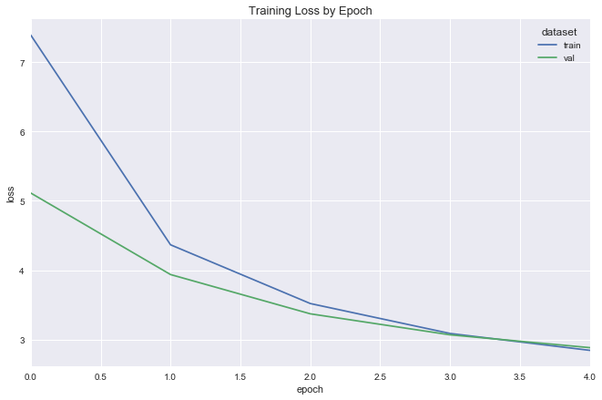
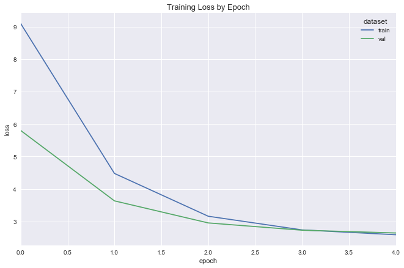
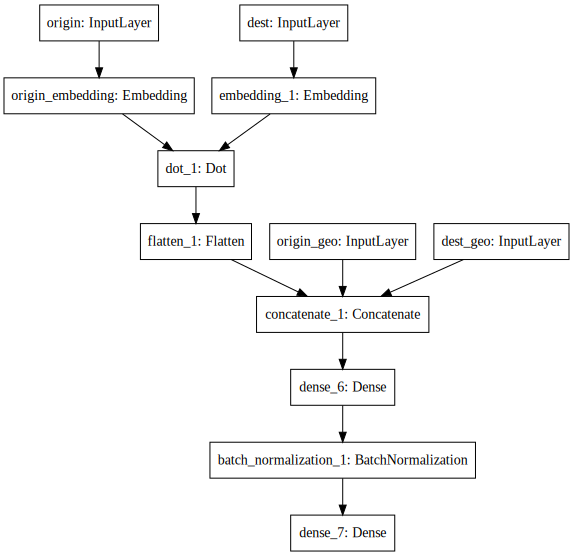
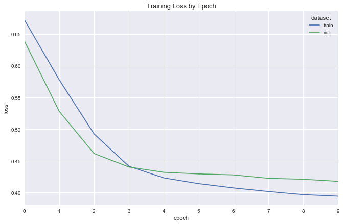
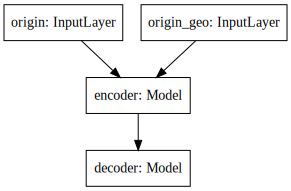
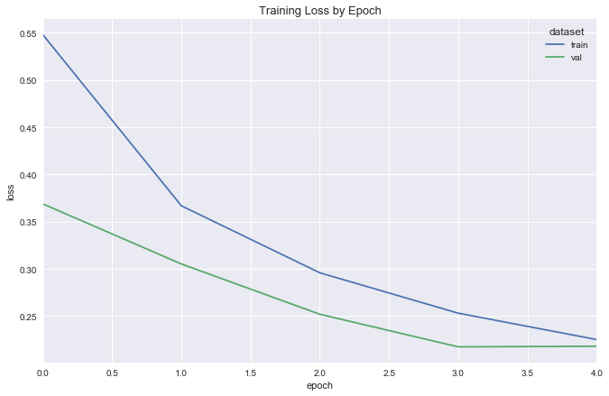
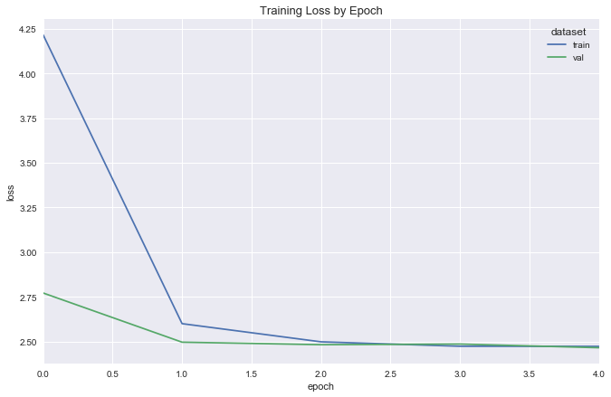

Title: Transfer Learning for Flight Delay Prediction via Variational Autoencoders
Date: 2017-05-08 12:45
Author: Will Wolf
Lang: en
Slug: transfer-learning-flight-delay-prediction
Status: published
Summary: Autoencoding airports via variational autoencoders to improve flight delay prediction. Additionally, a principled look at variational inference itself and its connections to machine learning.
Image: images/vae_map.png

In this work, we explore improving a vanilla regression model with knowledge learned elsewhere. As a motivating example, consider the task of predicting the number of checkins a given user will make at a given location. Our training data consist of checkins from 4 users across 4 locations in the week of May 1st, 2017 and looks as follows:

| user_id | location | checkins |
|---------|----------|----------|
| 1       | a        | 3        |
| 1       | b        | 6        |
| 2       | c        | 7        |
| 2       | d        | 2        |
| 3       | a        | 1        |
| 3       | c        | 4        |
| 4       | b        | 9        |
| 4       | d        | 4        |

We'd like to predict how many checkins user 3 will make at location `b` in the coming week. How well will our model do?

While each `user_id` might represent some unique behavior - e.g. user `3` sleeps late yet likes going out for dinner - and each location might represent its basic characteristics - e.g. location `b` is an open-late sushi bar - this is currently unbeknownst to our model. To this end, gathering this metadata and joining it to our training set is a clear option. If quality, thorough, explicit metadata are available, affordable and practical to acquire, this is likely the path to pursue. If not, we'll need to explore a more creative approach. How far can we get with *implicit* metadata learned from an external task?

## Transfer learning
Transfer learning allows us to use knowledge acquired in one task to improve performance in another. Suppose, for example, that we've been tasked with translating Portuguese to English and are given a basic phrasebook from which to learn. After a week, we take a lengthy test. A friend of ours - a fluent Spanish speaker who knows nothing of Portuguese - is tasked the same. Who gets a better score?

## Predicting flight delays
The goal of this work is to predict flight delays - a basic regression task. The data comprise 6,872,294 flights from 2008 via the [United States Department of Transportation's](https://www.transportation.gov/) [Bureau of Transportation Statistics](https://www.bts.gov/). I downloaded them from [stat-computing.org](http://stat-computing.org/dataexpo/2009/the-data.html).

Each row consists of, among other things: `DayOfWeek`, `DayofMonth`, `Month`, `ScheduledDepTimestamp` (munged from `CRSDepTime`), `Origin`, `Dest` and `UniqueCarrier` (airline), and well as `CarrierDelay`, `WeatherDelay`, `NASDelay`, `SecurityDelay`, `LateAircraftDelay` - all in minutes - which we will sum to create `total_delay`. We'll consider a random sample of 50,000 flights to make things easier. (For a more in-depth exploration of these data, please see this project's [repository](http://github.com/cavaunpeu/transfer-learning-for-flight-prediction/explore.R).)

## Routes, airports
While we can expect `DayOfWeek`, `DayofMonth` and `Month` to give some seasonal delay trends - delays are likely higher on Sundays or Christmas, for example - the `Origin` and `Dest` columns might suffer from the same pathology as `user_id` and `location` above: a rich behavioral indicator represented in a crude, "isolated" way. (A token in a bag-of-words model, as opposed to its respective word2vec representation, gives a clear analogy.) How can we infuse this behavioral knowledge into our original task?

## An auxiliary task
In 2015, I read a particularly-memorable blog post entitled [Towards Anything2Vec](http://allentran.github.io/graph2vec) by Allen Tran. Therein, Allen states:

> Like pretty much everyone, I'm obsessed with word embeddings word2vec or GloVe. Although most of machine learning in general is based on turning things into vectors, it got me thinking that we should probably be learning more fundamental representations for objects, rather than hand tuning features. Here is my attempt at turning random things into vectors, starting with graphs.

In this post, Allen seeks to embed nodes - U.S. patents, incidentally - in a directed graph into vector space by predicting the inverse of the path-length to nodes nearby. To me, this (thus-far) epitomizes the "data describe the individual better than they describe themself:" while we could ask the nodes to self-classify into patents on "computing," "pharma," "materials," etc., the connections between these nodes - formal citations, incidentally - will capture their "true" subject matters (and similarities therein) better than the authors ever could. Formal language, necessarily, generalizes.

[OpenFlights](https://openflights.org/data.html) contains data for over "10,000 airports, train stations and ferry terminals spanning the globe" and the routes between. My goal is to train a neural network that, given an origin airport and its latitude and longitude, predicts the destination airport, latitude and longitude. This network will thereby "encode" each airport into a vector of arbitrary size containing rich information about, presumably, the diversity and geography of the destinations it services: its "place" in the global air network. Surely, a global hub like Heathrow - a fact presumably known to our neural network, yet unknown to our initial dataset with one-hot airport indices - has longer delays on Christmas than than a two-plane airstrip in Alaska.

Crucially, we note that while our original (down-sampled) dataset contains delays amongst 298 unique airports, our auxiliary `routes` dataset comprises flights amongst 3186 unique airports. Notwithstanding, information about *all* airports in the latter is *distilled* into vector representations then injected into the former; even though we might not know about delays to/from Casablanca Mohammed V Airport (CMN), latent information about this airport will still be *intrinsically considered* when predicting delays between other airports to/from which CMN flies.

## Data preparation
Our flight-delay design matrix $X$ will include the following columns: `DayOfWeek`, `DayofMonth`, `Month`, `ScheduledDepTimestamp`, `Origin`, `Dest` and `UniqueCarrier`. All columns will be one-hotted for simplicity. (Alternatively, I explored mapping each column to its respective `value_counts()`, i.e. `X.loc[:, col] = X[col].map(col_val_counts)`, which led to less agreeable convergence.)

Let's get started.

```python
FLIGHTS_PATH = '../data/flights-2008-sample.feather'

# build X, y
flights = feather.read_dataframe(FLIGHTS_PATH)
X = flights[['DayOfWeek', 'DayofMonth', 'Month', 'ScheduledDepTimestamp', 'Origin', 'Dest', 'UniqueCarrier']].copy()
y = flights['total_delay'].copy()

# one-hot
one_hot_matrices = []
for col in filter(lambda col: col != 'ScheduledDepTimestamp', X.columns):
    one_hot_matrices.append( pd.get_dummies(X[col]) )

one_hot_matrix = np.concatenate(one_hot_matrices, axis=1)
X = np.hstack([ X['ScheduledDepTimestamp'].values.reshape(-1, 1), one_hot_matrix ])

# normalize
X = StandardScaler().fit_transform(X)
y = np.log(y + 1).values
```

```python
TEST_SIZE = int(X.shape[0] * .4)


X_train, X_test, y_train, y_test = train_test_split(X, y, test_size=TEST_SIZE, random_state=42)
X_val, X_test, y_val, y_test = train_test_split(X_test, y_test, test_size=int(TEST_SIZE / 2), random_state=42)

print('Dataset sizes:')
print('    Train:      {}'.format(X_train.shape))
print('    Validation: {}'.format(X_val.shape))
print('    Test:       {}'.format(X_test.shape))
```

    Dataset sizes:
        Train:      (30000, 657)
        Validation: (10000, 657)
        Test:       (10000, 657)

## Flight-delay models
Let's build two baseline models with the data we have. Both models have a single ReLU output and are trained to minimize the mean squared error of the predicted delay via stochastic gradient descent.

ReLU was chosen as an output activation because delays are both bounded below at 0 and bi-modal. I considered three separate strategies for predicting this distribution.
1. Train a network with two outputs: `total_delay` and `total_delay == 0` (Boolean). Optimize this network with a composite loss function: mean squared error and binary cross-entropy, respectively.
2. Train a "poor-man's" hierarchical model: a logistic regression to predict `total_delay == 0` and a standard regression to predict `total_delay`. Then, compute the final prediction as a thresholded ternary, e.g. `y_pred = np.where(y_pred_lr > threshhold, 0, y_pred_reg)`. Train the regression model with both all observations, and just those where `total_delay > 0`, and see which works best.
3. Train a single network with a ReLU activation. This gives a reasonably elegant way to clip our outputs below at 0, and mean-squared-error still tries to place our observations into the correct mode (of the bimodal output distribution; this said, mean-squared-error may try to "play it safe" and predict between the modes).

I chose Option #3 because it performed best in brief experimentation and was the simplest to both fit and explain.

```python
class BaseEmbeddingModel(metaclass=ABCMeta):

    def compile(self, optimizer, loss, *args, **kwargs):
        self.model.compile(optimizer, loss)

    def summary(self):
        return self.model.summary()

    def fit(self, *args, **kwargs):
        return self.model.fit(*args, **kwargs)

    def predict(self, X):
        return self.model.predict(X)

    @abstractmethod
    def _build_model(self):
        pass


class SimpleRegression(BaseEmbeddingModel):

    def __init__(self, input_dim: int, λ: float):
        '''Initializes the model parameters.

        Args:
            input_dim : The number of columns in our design matrix.
            λ : The regularization strength to apply to the model's
                dense layers.
        '''
        self.input_dim = input_dim
        self.λ = λ
        self.model = self._build_model()

    def _build_model(self):
        input = Input((self.input_dim,), dtype='float32')
        dense = Dense(144, activation='relu', kernel_regularizer=l2(self.λ))(input)
        output = Dense(1, activation='relu', name='regression_output', kernel_regularizer=l2(self.λ))(dense)

        return Model(input, output)


class DeeperRegression(BaseEmbeddingModel):

    def __init__(self, input_dim: int, λ: float, dropout_p: float):
        '''Initializes the model parameters.

        Args:
            input_dim : The number of columns in our design matrix.
            λ : The regularization strength to apply to the model's
                dense layers.
            dropout_p : The percentage of units to drop in the model's
                dropout layer.
        '''
        self.input_dim = input_dim
        self.λ = λ
        self.dropout_p = dropout_p
        self.model = self._build_model()

    def _build_model(self):
        input = Input((self.input_dim,), dtype='float32', name='input')
        dense = Dense(144, activation='relu', kernel_regularizer=l2(self.λ))(input)
        dense = Dense(144, activation='relu', kernel_regularizer=l2(self.λ))(dense)
        dense = Dropout(self.dropout_p)(dense)
        dense = Dense(72, activation='relu', kernel_regularizer=l2(self.λ))(dense)
        dense = Dense(16, activation='relu', kernel_regularizer=l2(self.λ))(dense)
        output = Dense(1, activation='relu', name='regression_output')(dense)

        return Model(input, output)
```

## Simple regression

```python
LEARNING_RATE = .0001


simple_reg = SimpleRegression(input_dim=X.shape[1], λ=.05)
simple_reg.compile(optimizer=Adam(lr=LEARNING_RATE), loss='mean_squared_error')

simple_reg_fit = fit_flight_model(simple_reg, X_train, y_train, X_val, y_val, epochs=5, batch_size=16)
plot_model_fit(simple_reg_fit)
```




## Deeper regression

```python
deeper_reg = DeeperRegression(input_dim=X.shape[1], λ=.03, dropout_p=.2)
deeper_reg.compile(optimizer=Adam(lr=.0001), loss='mean_squared_error')

deeper_reg_fit = fit_flight_model(deeper_reg, X_train, y_train, X_val, y_val, epochs=5, batch_size=16)
plot_model_fit(deeper_reg_fit)
```



## Test set predictions

```python
y_pred_simple = simple_reg.model.predict(X_test).ravel()
y_pred_deeper = deeper_reg.model.predict(X_test).ravel()
mse_simple = mean_squared_error_scikit(y_test, y_pred_simple)
mse_deeper = mean_squared_error_scikit(y_test, y_pred_deeper)

print('Mean squared error, simple regression: {}'.format(mse_simple))
print('Mean squared error, deeper regression: {}'.format(mse_deeper))
```

    Mean squared error, simple regression: 2.331459019628268
    Mean squared error, deeper regression: 2.3186310632259204


## Learning airport embeddings
We propose two networks through which to learn airport embeddings: a dot product siamese network, and a [variational autoencoder](https://jaan.io/what-is-variational-autoencoder-vae-tutorial/).

## Dot product siamese network
This network takes as input origin and destination IDs, latitudes and longitudes. It gives as output a binary value indicating whether or not a flight-route between these airports exists. The `airports` DataFrame gives the geographic metadata. The `routes` DataFrame gives *positive* training examples for our network. To build negative samples, we employ, delightfully, "negative sampling."

### Negative sampling
`routes` gives exlusively `(origin, dest, exists = 1)` triplets. To create triplets where `exists = 0`, we simply build them ourself: `(origin, fake_dest, exists = 0)`. It's that simple.

Inspired by [word2vec's approach](http://mccormickml.com/2017/01/11/word2vec-tutorial-part-2-negative-sampling/) to an almost identical problem, I pick `fake_dest`'s based on the frequency with which they occur in the dataset - more frequent samples being more likely to be selected - via:

$$P(a_i) = \frac{  {f(a_i)}^{3/4}  }{\sum_{j=0}^{n}\left(  {f(a_j)}^{3/4} \right) }$$

where $a_i$ is an airport. To choose a `fake_dest` for a given `origin`, we first remove all of the real `dest`'s, re-normalize $P(a)$, then take a multinomial draw.

For a more complete yet equally approachable explanation, please see [Goldberg and Levy](https://arxiv.org/pdf/1402.3722.pdf). For an *extremely thorough* review of related methods, see Sebastian Ruder's [On word embeddings - Part 2: Approximating the Softmax](http://sebastianruder.com/word-embeddings-softmax/).


## Variational autoencoder

### Discriminative models
The previous network is a *discriminative* model: given two inputs `origin` and `dest`, it outputs the conditional probability that `exists = 1`. While discriminative models are effective in distinguishing *between* output classes, they don't offer an idea of what data look like within each class itself. To see why, let's restate Bayes rule for a given input $x$:

$$P(Y\vert x) = \frac{P(x\vert Y)P(Y)}{P(x)} = \frac{P(x, Y)}{P(x)}$$

_**Discriminative classifiers jump directly to estimating $P(Y\vert x)$ without modeling its component parts $P(x, Y)$ and $P(x)$.**_

Instead, as the intermediate step, they simply compute an *unnormalized* joint distribution $\tilde{P}(x, Y)$ and a normalizing "partition function." The following then gives the model's predictions for the same reason that $\frac{.2}{1} = \frac{3}{15}$:

$$P(Y\vert x) = \frac{P(x, Y)}{P(x)} = \frac{\tilde{P}(x, Y)}{\text{partition function}}$$

This is explained much more thoroughly in a previous blog post: [Deriving the Softmax from First Principles]({filename}deriving-the-softmax-from-first-principles.md).

### Generative models
Conversely, a variational autoencoder is a *generative* model: instead of jumping *directly* to the conditional probability of all possible outputs given a specific input, they first compute the true component parts: the joint probability distribution over data and inputs alike, $P(X, Y)$, and the distribution over our data, $P(X)$.

The joint probability can be rewritten as $P(X, Y) = P(Y)P(X\vert Y)$: as such, generative models tell us the distribution over classes in our dataset, as well as the distribution of inputs within each class. Suppose we are trying to predict t-shirt colors with a 3-feature input; generative models would tell us: "30% of your t-shirts are green - typically produced by inputs near `x = [1, 2, 3]`; 40% are red - typically produced by inputs near `x = [10, 20, 30]`; 30% are blue - typically produced by inputs near `x = [100, 200, 300]`. This is in contrast to a discriminative model which would simply compute: given an input $x$, your output probabilities are: $\{\text{red}: .2, \text{green}: .3, \text{blue}: .5\}$.

_**To generate new data with a generative model, we draw from $P(Y)$, then $P(X\vert Y)$. To make predictions, we solicit $P(Y), P(x\vert Y)$ and $P(x)$ and employ Bayes rule outright.**_

### Manifold assumption
The goal of both autoencoders is to discover underlying "structure" in our data: while each airport can be one-hot encoded into a 3186-dimensional vector, we wish to learn a, or even the, reduced space in which our data both live and vary. This concept is well understood through the "manifold assumption," explained succinctly in this [CrossValidated thread](https://stats.stackexchange.com/questions/66939/what-is-the-manifold-assumption-in-semi-supervised-learning):

> Imagine that you have a bunch of seeds fastened on a glass plate, which is resting horizontally on a table. Because of the way we typically think about space, it would be safe to say that these seeds live in a two-dimensional space, more or less, because each seed can be identified by the two numbers that give that seed's coordinates on the surface of the glass.
>
> Now imagine that you take the plate and tilt it diagonally upwards, so that the surface of the glass is no longer horizontal with respect to the ground. Now, if you wanted to locate one of the seeds, you have a couple of options. If you decide to ignore the glass, then each seed would appear to be floating in the three-dimensional space above the table, and so you'd need to describe each seed's location using three numbers, one for each spatial direction. But just by tilting the glass, you haven't changed the fact that the seeds still live on a two-dimensional surface. So you could describe how the surface of the glass lies in three-dimensional space, and then you could describe the locations of the seeds on the glass using your original two dimensions.
>
> In this thought experiment, the glass surface is akin to a low-dimensional manifold that exists in a higher-dimensional space : no matter how you rotate the plate in three dimensions, the seeds still live along the surface of a two-dimensional plane.

In other words, the full spectrum of that which characterizes an airport can be described by just a few numbers. Varying one of these numbers - making it larger or smaller - would result in an airport of slightly different "character;" if one dimension were to represent "global travel hub"-ness, a value of $-1000$ along this dimension might give us that hangar in Alaska.

_**In the context of autoencoders (and dimensionality reduction algorithms), "learning 'structure' in our data" means nothing more than finding that ceramic plate amidst a galaxy of stars**_.

### Graphical models
Variational autoencoders do not have the same notion of an "output" - namely, "does a route between two airports exist?" - as our dot product siamese network. To detail this model, we'll start near first principles with probabilistic graphical models with our notion of the ceramic plate in mind:


Coordinates on the plate detail airport character; choosing coordinates - say, `[global_hub_ness = 500, is_in_asia = 500]` - allows us to *generate* an airport. In this case, it might be Seoul. In variational autoencoders, ceramic-plate coordinates are called the "latent vector," denoted $z$. The joint probability of our graphical model is given as:

$$P(z)P(x\vert z) = P(z, x)$$

Our goal is to infer the priors that likely generated these data via Bayes rule:

$$P(z\vert x) = \frac{P(z)P(x\vert z)}{P(x)}$$

The denominator is called the **evidence**; we obtain it by marginalizing the joint distribution over the latent variables:

$$P(x) = \int P(x\vert z)P(z)dz$$

Unfortunately, this asks us to consider *all possible configurations* of the latent vector $z$. Should $z$ exist on the vertices of a cube in $\mathbb{R}^3$, this would not be very difficult; should $z$ be a continuous-valued vector in $\mathbb{R}^{10}$, this becomes a whole lot harder. Computing $P(x)$ is problematic.

### Variational inference
In fact, we could attempt to use MCMC to compute $P(z\vert x)$; however, this is slow to converge. Instead, let's compute an *approximation* to this distribution then try to make it closely resemble the (intractable) original. In this vein, we introduce [variational inference](https://www.cs.princeton.edu/courses/archive/fall11/cos597C/lectures/variational-inference-i.pdf), which "allows us to re-write statistical inference problems (i.e. infer the value of a random variable given the value of another random variable) as optimization problems (i.e. find the parameter values that minimize some objective function)."<sup>[1](#footnotes)</sup>

Let's choose our approximating distribution as simple, parametric and one we know well: the Normal (Gaussian) distribution. Were we able to compute $P(z\vert x) = \frac{P(x, z)}{P(x)}$, it is *instrinsic* that $z$ is contingent on $x$; when building our own distribution to approximate $P(z\vert x)$, we need to be *explicit* about this contingency: different values for $x$ should be assumed to have been generated by different values of $z$. Let's write our approximation as follows, where $\lambda$ parameterizes the Gaussian for a given $x$:

$$q_{\lambda}(z\vert x)$$

Finally, as stated previously, we want to make this approximation closely resemble the original; the [KL divergence](https://en.wikipedia.org/wiki/Kullback%E2%80%93Leibler_divergence) quantifies their difference:

$$KL(q_{\lambda}(z\vert x)\Vert P(z\vert x)) = \int{q_{\lambda}(z\vert x)\log\frac{q_{\lambda}(z\vert x)}{P(z\vert x)}dz}$$

Our goal is to obtain the argmin with respect to $\lambda$:

$$q_{\lambda}^{*}(z\vert x) = \underset{\lambda}{\arg\min}\ \text{KL}(q_{\lambda}(z\vert x)\Vert P(z\vert x))$$

Expanding the divergence, we obtain:

$$
\begin{align*}
KL(q_{\lambda}(z\vert x)\Vert P(z\vert x))
&= \int{q_{\lambda}(z\vert x)\log\frac{q_{\lambda}(z\vert x)}{P(z\vert x)}dz}\\
&= \int{q_{\lambda}(z\vert x)\log\frac{q_{\lambda}(z\vert x)P(x)}{P(z, x)}dz}\\
&= \int{q_{\lambda}(z\vert x)\bigg(\log{q_{\lambda}(z\vert x) -\log{P(z, x)} + \log{P(x)}}\bigg)dz}\\
&= \int{q_{\lambda}(z\vert x)\bigg(\log{q_{\lambda}(z\vert x)} -\log{P(z, x)}}\bigg)dz + \log{P(x)}\int{q_{\lambda}(z\vert x)dz}\\
&= \int{q_{\lambda}(z\vert x)\bigg(\log{q_{\lambda}(z\vert x)} -\log{P(z, x)}}\bigg)dz + \log{P(x)} \cdot 1
\end{align*}
$$

As such, since only the left term depends on $\lambda$, minimizing the entire expression with respect to $\lambda$ amounts to minimizing this term. Incidentally, the opposite (negative) of this term is called the [ELBO](https://www.cs.princeton.edu/courses/archive/fall11/cos597C/lectures/variational-inference-i.pdf), or the "evidence lower bound." To see why, let's plug the ELBO into the equation above and solve for $\log{P(x)}$:

$$\log{P(x)} = ELBO(\lambda) + KL(q_{\lambda}(z\vert x)\Vert P(z\vert x))$$

In English: "the log of the evidence is at least the lower bound of the evidence plus the divergence between our true posterior $P(z\vert x)$ and our (variational) approximation to this posterior $q_{\lambda}(z\vert x)$."

Since the left term above is the opposite of the ELBO, minimizing this term is equivalent to *maximizing* the ELBO.

Let's restate the equation and rearrange further:

$$
\begin{align*}
ELBO(\lambda)
&= -\int{q_{\lambda}(z\vert x)\bigg(\log{q_{\lambda}(z\vert x)} -\log{P(z, x)}}\bigg)dz\\
&= -\int{q_{\lambda}(z\vert x)\bigg(\log{q_{\lambda}(z\vert x)} -\log{P(x\vert z)} - \log{P(z)}}\bigg)dz\\
&= -\int{q_{\lambda}(z\vert x)\bigg(\log{q_{\lambda}(z\vert x)} - \log{P(z)}}\bigg)dz + \log{P(x\vert z)}\int{q_{\lambda}(z\vert x)dz}\\
&= -\int{q_{\lambda}(z\vert x)\log{\frac{q_{\lambda}(z\vert x)}{P(z)}}dz} + \log{P(x\vert z)} \cdot 1\\
&= \log{P(x\vert z)} -KL(q_{\lambda}(z\vert x)\Vert P(z))
\end{align*}
$$

Our goal is to maximize this expression, or minimize the opposite:

$$-\log{P(x\vert z)} + KL(q_{\lambda}(z\vert x)\Vert P(z))$$

In machine learning parlance: "minimize the negative log likelihood of our data (generated via $z$) plus the divergence between the distribution (ceramic plate) of $z$ and our approximation thereof."

See what we did?

### Finally, back to neural nets
The variational autoencoder consists of an encoder network and a decoder network.

#### Encoder
The encoder network takes as input $x$ (an airport) and produces as output $z$ (the latent "code" of that airport, i.e. its location on the ceramic plate). As an intermediate step, it produces multivariate Gaussian parameters $(\mu_{x_i}, \sigma_{x_i})$ for each airport. These parameters are then plugged into a Gaussian $q$, from which we *sample* a value $z$. The encoder is parameterized by a weight matrix $\theta$.

#### Decoder
The decoder network takes as input $z$ and produces $P(x\vert z)$: a reconstruction of the airport vector (hence, autoencoder). It is parameterized by a weight matrix $\phi$.

#### Loss function
The network's loss function is the sum of the mean squared reconstruction error of the original input $x$ and the KL divergence between the true distribution of $z$ and its approximation $q$. Given the reparameterization trick (next section) and another healthy scoop of algebra, we write this in Python code as follows:

```python
'''
`z_mean` gives the mean of the Gaussian that generates `z`
`z_log_var` gives the log-variance of the Gaussian that generates `z`
`z` is generated via:

  z = z_mean + K.exp(z_log_var / 2) * epsilon
    = z_mean + K.exp( log(z_std)**2 / 2 ) * epsilon
    = z_mean + K.exp( (2 * log(z_std) / 2 ) * epsilon
    = z_mean + K.exp( log(z_std) ) * epsilon
    = z_mean + z_std * epsilon
'''
kl_loss_numerator = 1 + z_log_var - K.square(z_mean) - K.exp(z_log_var)
kl_loss = -0.5 * K.sum(kl_loss_numerator, axis=-1)

def loss(x, x_decoded):
    return mean_squared_error(x, x_decoded) + kl_loss
```

### Reparameterization trick
When back-propagating the network's loss to $\theta$ , we need to go through $z$ — *a sample* taken from $q_{\theta}(z\vert x)$. Trivially, this sample is a scalar; intuitively, its derivative should be non-zero. In solution, we'd like the sample to depend not on the *stochasticity* of the random variable, but on the random variable's *parameters*. To this end, we employ the ["reparametrization trick"](https://stats.stackexchange.com/questions/199605/how-does-the-reparameterization-trick-for-vaes-work-and-why-is-it-important), such that the sample depends on these parameters *deterministically*.

As a quick example, this trick allows us to write $\mathcal{N}(\mu, \sigma)$ as $z = \mu + \sigma \odot \epsilon$, where $\epsilon \sim \mathcal{N}(0, 1)$. Drawing samples this way allows us to propagate error backwards through our network.


## Auxiliary data

```python
# build X_routes, y_routes
geo_cols = ['origin_latitude', 'origin_longitude', 'dest_latitude', 'dest_longitude']
X_r = routes[ ['origin_id', 'dest_id'] + geo_cols ].copy()
y_r = routes['exists'].copy()

X_r.loc[:, geo_cols] = StandardScaler().fit_transform( X_r[geo_cols] )

# split training, test data
test_size = X_r.shape[0] // 3
val_size = test_size // 2

X_train_r, X_test_r, y_train_r, y_test_r = train_test_split(X_r, y_r, test_size=test_size, random_state=42)
X_val_r, X_test_r, y_val_r, y_test_r = train_test_split(X_test_r, y_test_r, test_size=val_size, random_state=42)

print('Dataset sizes:')
print('    Train:      {}'.format(X_train_r.shape))
print('    Validation: {}'.format(X_val_r.shape))
print('    Test:       {}'.format(X_test_r.shape))
```

    Dataset sizes:
        Train:      (87630, 6)
        Validation: (21907, 6)
        Test:       (21907, 6)


## Dot product embedding model

To start, let's train our model with a single latent dimension then visualize the results on the world map.

```python
N_UNIQUE_AIRPORTS = len(unique_airports)


class DotProductEmbeddingModel(BaseEmbeddingModel):

    def __init__(self, embedding_size: int, λ: float, n_unique_airports=N_UNIQUE_AIRPORTS):
        '''Initializes the model parameters.

        Args:
            embedding_size : The desired number of latent dimensions in our
                embedding space.
            λ : The regularization strength to apply to the model's
                dense layers.
        '''
        self.n_unique_airports = n_unique_airports
        self.embedding_size = embedding_size
        self.λ = λ
        self.model = self._build_model()

    def _build_model(self):
        # inputs
        origin = Input(shape=(1,), name='origin')
        dest = Input(shape=(1,), name='dest')
        origin_geo = Input(shape=(2,), name='origin_geo')
        dest_geo = Input(shape=(2,), name='dest_geo')

        # embeddings
        origin_embedding = Embedding(self.n_unique_airports, output_dim=self.embedding_size,
                                     embeddings_regularizer=l2(self.λ), name='origin_embedding')(origin)
        dest_embedding = Embedding(self.n_unique_airports, output_dim=self.embedding_size, embeddings_regularizer=l2(self.λ))(dest)

        # dot product
        dot_product = dot([origin_embedding, dest_embedding], axes=2)
        dot_product = Flatten()(dot_product)
        dot_product = concatenate([dot_product, origin_geo, dest_geo], axis=1)

        # dense layers
        tanh = Dense(10, activation='tanh')(dot_product)
        tanh = BatchNormalization()(tanh)

        # output
        exists = Dense(1, activation='sigmoid')(tanh)

        return Model(inputs=[origin, dest, origin_geo, dest_geo], outputs=[exists])
```

```python
dp_model = DotProductEmbeddingModel(embedding_size=1, λ=.0001)
dp_model.compile(optimizer=Adam(lr=.001), loss='binary_crossentropy')
SVG(model_to_dot(dp_model.model).create(prog='dot', format='svg'))
```



## Fit



## Visualize embeddings

To visualize results, we'll:
1. Compose a list of unique origin airports.
2. Extract the learned (1-dimensional) embedding for each.
3. Scale the results to $[0, 1]$.
4. Use the scaled embedding as a percentile-index into a color gradient. Here, we've chosen the colors of the rainbow: low values are blue/purple, and high values are orange/red.

```python
plot_embeddings_on_world_map(unique_origins, output_path='../figures/dp_model_map.html')
```

<iframe width="1000" height="800" src="https://willwolf-public.s3.amazonaws.com/transfer-learning-flight-delays/dp_model_map.html" frameborder="0" allowfullscreen></iframe>

## Variational autoencoder

```python
class VariationalLayer(KerasLayer):

    def __init__(self, output_dim: int, epsilon_std=1.):
        '''A custom "variational" Keras layer that completes the
        variational autoencoder.

        Args:
            output_dim : The desired number of latent dimensions in our
                embedding space.
        '''
        self.output_dim = output_dim
        self.epsilon_std = epsilon_std
        super().__init__()

    def build(self, input_shape):
        self.z_mean_weights = self.add_weight(
            shape=(input_shape[1], self.output_dim),
            initializer='glorot_normal',
            trainable=True
        )
        self.z_mean_bias = self.add_weight(
            shape=(self.output_dim,),
            initializer='zero',
            trainable=True,
        )
        self.z_log_var_weights = self.add_weight(
            shape=(input_shape[1], self.output_dim),
            initializer='glorot_normal',
            trainable=True
        )
        self.z_log_var_bias = self.add_weight(
            shape=(self.output_dim,),
            initializer='zero',
            trainable=True
        )
        super().build(input_shape)

    def call(self, x):
        z_mean = K.dot(x, self.z_mean_weights) + self.z_mean_bias
        z_log_var = K.dot(x, self.z_log_var_weights) + self.z_log_var_bias
        epsilon = K.random_normal(
            shape=K.shape(z_log_var),
            mean=0.,
            stddev=self.epsilon_std
        )

        kl_loss_numerator = 1 + z_log_var - K.square(z_mean) - K.exp(z_log_var)
        self.kl_loss = -0.5 * K.sum(kl_loss_numerator, axis=-1)
        return z_mean + K.exp(z_log_var / 2) * epsilon

    def loss(self, x, x_decoded):
        return mean_squared_error(x, x_decoded) + self.kl_loss

    def compute_output_shape(self, input_shape):
        return (input_shape[0], self.output_dim)
```

```python
class VariationalAutoEncoderEmbeddingModel(BaseEmbeddingModel):

    def __init__(self, embedding_size: int, dense_layer_size: int, λ: float, n_unique_airports=N_UNIQUE_AIRPORTS):
        '''Initializes the model parameters.

        Args:
            embedding_size : The desired number of latent dimensions in our
                embedding space.
            λ : The regularization strength to apply to the model's
                dense layers.
        '''
        self.embedding_size = embedding_size
        self.dense_layer_size = dense_layer_size
        self.λ = λ
        self.n_unique_airports = n_unique_airports
        self.variational_layer = VariationalLayer(embedding_size)
        self.model = self._build_model()

    def _build_model(self):
        # encoder
        origin = Input(shape=(self.n_unique_airports,), name='origin')
        origin_geo = Input(shape=(2,), name='origin_geo')
        dense = concatenate([origin, origin_geo])
        dense = Dense(self.dense_layer_size, activation='tanh', kernel_regularizer=l2(self.λ))(dense)
        dense = BatchNormalization()(dense)
        variational_output = self.variational_layer(dense)

        encoder = Model([origin, origin_geo], variational_output, name='encoder')

        # decoder
        latent_vars = Input(shape=(self.embedding_size,))
        dense = Dense(self.dense_layer_size, activation='tanh', kernel_regularizer=l2(self.λ))(latent_vars)
        dense = Dense(self.dense_layer_size, activation='tanh', kernel_regularizer=l2(self.λ))(dense)
        dense = BatchNormalization()(dense)
        dest = Dense(self.n_unique_airports, activation='softmax', name='dest', kernel_regularizer=l2(self.λ))(dense)
        dest_geo = Dense(2, activation='linear', name='dest_geo')(dense)

        decoder = Model(latent_vars, [dest, dest_geo], name='decoder')

        # end-to-end
        encoder_decoder = Model([origin, origin_geo], decoder(encoder([origin, origin_geo])))
        return encoder_decoder
```

```python
vae_model = VariationalAutoEncoderEmbeddingModel(embedding_size=1, dense_layer_size=20, λ=.003)
vae_model.compile(optimizer=Adam(lr=LEARNING_RATE), loss=[vae_model.variational_layer.loss, 'mean_squared_logarithmic_error'],
                  loss_weights=[1., .2])
SVG(model_to_dot(vae_model.model).create(prog='dot', format='svg'))
```



```python
# build VAE training, test sets
one_hot_airports = np.eye(N_UNIQUE_AIRPORTS)

X_train_r_origin = one_hot_airports[ X_train_r['origin_id'] ]
X_val_r_origin   = one_hot_airports[ X_val_r['origin_id']   ]
X_test_r_origin  = one_hot_airports[ X_test_r['origin_id']  ]
X_train_r_dest   = one_hot_airports[ X_train_r['dest_id']   ]
X_val_r_dest     = one_hot_airports[ X_val_r['dest_id']     ]
X_test_r_dest    = one_hot_airports[ X_test_r['dest_id']    ]

print('Dataset sizes:')
print('    Train:      {}'.format(X_train_r_origin.shape))
print('    Validation: {}'.format(X_val_r_origin.shape))
print('    Test:       {}'.format(X_test_r_origin.shape))
```

    Dataset sizes:
        Train:      (87630, 3186)
        Validation: (21907, 3186)
        Test:       (21907, 3186)

## Fit


## Visualize
<iframe width="1000" height="800" src="https://willwolf-public.s3.amazonaws.com/transfer-learning-flight-delays/vae_model_map.html" frameborder="0" allowfullscreen></iframe>

## Finally, transfer the learning

Retrain both models with 20 latent dimensions, then join the embedding back to our original dataset.

## Extract embeddings, construct joint dataset
    Dataset sizes:
        Train:      (30000, 151)
        Validation: (10000, 151)
        Test:       (10000, 151)


## Train original models

```python
simple_reg = SimpleRegression(input_dim=X.shape[1], λ=.05)
simple_reg.compile(optimizer=Adam(lr=.0005), loss='mean_squared_error')
simple_reg_fit = fit_flight_model(simple_reg, X_train, y_train, X_val, y_val, epochs=5, batch_size=16)

plot_model_fit(simple_reg_fit)
```




```python
deeper_reg = DeeperRegression(input_dim=X.shape[1], λ=.03, dropout_p=.2)
deeper_reg.compile(optimizer=Adam(lr=.0001), loss='mean_squared_error')
deeper_reg_fit = fit_flight_model(deeper_reg, X_train, y_train, X_val, y_val, epochs=5, batch_size=16)

plot_model_fit(deeper_reg_fit)
```


```python
y_pred_simple = simple_reg.model.predict(X_test).ravel()
y_pred_deeper = deeper_reg.model.predict(X_test).ravel()
mse_simple = mean_squared_error_scikit(y_test, y_pred_simple)
mse_deeper = mean_squared_error_scikit(y_test, y_pred_deeper)

print('Mean squared error, simple regression: {}'.format(mse_simple))
print('Mean squared error, deeper regression: {}'.format(mse_deeper))
```

    Mean squared error, simple regression: 2.3176028493805263
    Mean squared error, deeper regression: 2.291221474968889

## Summary

In fitting these models to both the original and "augmented" datasets, I spent time tuning their parameters — regularization strengths, amount of dropout, number of epochs, learning rates, etc. Additionally, the respective datasets are of different dimensionality. For these reasons, comparison between the two sets of models is clearly not "apples to apples."

Notwithstanding, the airport embeddings do seem to provide a nice lift over our original one-hot encodings. Of course, their use is not limited to predicting flight delays: they can be used in any task concerned with airports. Additionally, these embeddings give insight into the nature of the airports themselves: those nearby in vector space can be considered as "similar" by some latent metric. To figure out what these metrics mean, though - it's back to the map.

## Additional Resources

- [Towards Anything2Vec](http://allentran.github.io/graph2vec)
- [Deep Learning for Calcium Imaging](http://ben.bolte.cc/blog/2017/unsupervised-calcium-modeling.html)
- [DeepWalk: Online Learning of Social Representations](https://arxiv.org/pdf/1403.6652.pdf)
- [Variational Autoencoder: Intuition and Implementation](http://wiseodd.github.io/techblog/2016/12/10/variational-autoencoder/)
- [Introducing Variational Autoencoders (in Prose and Code)](http://blog.fastforwardlabs.com/2016/08/12/introducing-variational-autoencoders-in-prose-and.html)
- [Variational auto-encoder for "Frey faces" using keras](http://dohmatob.github.io/research/2016/10/22/VAE.html)
- [Transfer Learning - Machine Learning's Next Frontier](http://sebastianruder.com/transfer-learning/)
- [Tutorial - What is a variational autoencoder?](https://jaan.io/what-is-variational-autoencoder-vae-tutorial/)
- [A Beginner's Guide to Variational Methods: Mean-Field Approximation](http://blog.evjang.com/2016/08/variational-bayes.html)
- [Variational Autoencoder: Intuition and Implementation](http://wiseodd.github.io/techblog/2016/12/10/variational-autoencoder/)
- [CrossValidated - What is the manifold assumption in semi-supervised learning?](https://stats.stackexchange.com/questions/66939/what-is-the-manifold-assumption-in-semi-supervised-learning)
- [David Blei - Variational Inference](https://www.cs.princeton.edu/courses/archive/fall11/cos597C/lectures/variational-inference-i.pdf)
- [Edward - Variational Inference](http://edwardlib.org/tutorials/variational-inference)
- [On Discriminative vs. Generative classifiers: A comparison of logistic regression and naive Bayes](http://papers.nips.cc/paper/2020-on-discriminative-vs-generative-classifiers-a-comparison-of-logistic-regression-and-naive-bayes.pdf)

## Code

The repository for this project can be found [here](https://github.com/cavaunpeu/flight-delays).

<a id="footnotes"></a>

## Footnotes

1: [A Beginner's Guide to Variational Methods: Mean-Field Approximation](http://blog.evjang.com/2016/08/variational-bayes.html)
