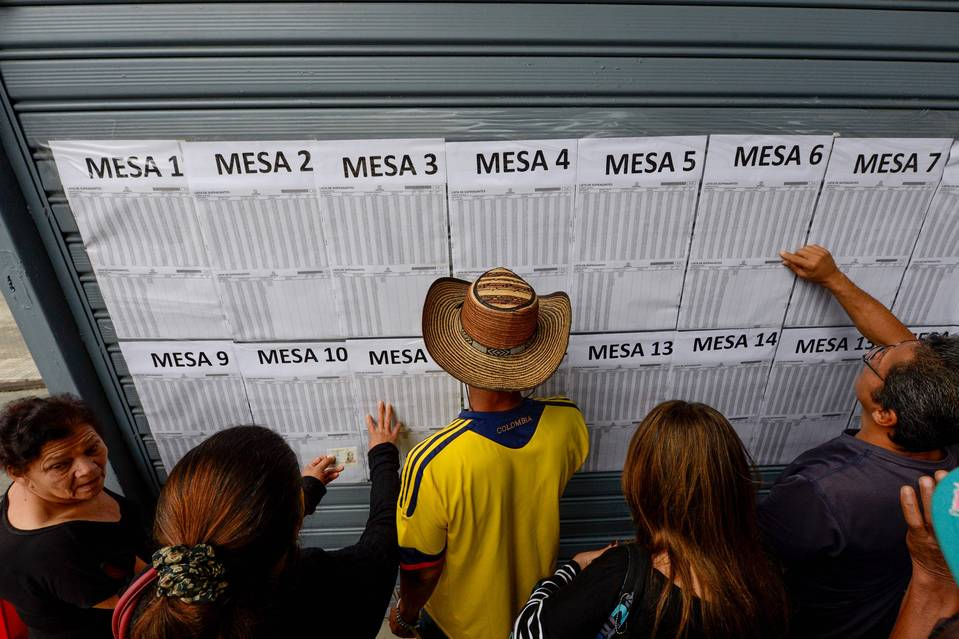

Title: Simulación Estadística del Plebiscito Colombiano: ¿Realmente Ganaron Los del "No?"
Date: 2016-10-12 11:53
Author: admin
Category: Uncategorized
Slug: simulating-the-colombian-peace-vote-did-the-no-really-win-2
Status: published

El 2 de octubre del 2016, observé con terror como los
colombianos votaron por el "No" en su plebiscito nacional para decretar
el recién firmado acuerdo de paz. En la siguiente semana, medité sobre
el resultado y las cosas que hubieran sucedido: la gran campaña de
desinformación, las payasadas de Uribe y lo súper bueno que realmente
parecía el
[acuerdo](https://www.youtube.com/playlist?list=PLa28R7QEiMblKeZ_OlZ_XfjjxjfeIhpuL) mismo.
Hace dos días, me topé por casualidad con este
[post](https://theconversation.com/colombia-did-not-vote-no-in-its-peace-referendum-what-the-statistics-reveal-66471),
que nos pide recordar que el margen escaso con el que ganó el "No"
- 6,431,376 vs. 6,377,482 - no es particularmente convincente, ni, en
realidad, tan decisivo frente al error humano.

> And as with all manual voting systems, one cannot rule out at least
> some degree of misclassification of papers on some scale, no matter
> how small. We know of no evidence of cheating, and Colombia is to be
> lauded for the seriousness of its referendum process, but the
> distinction between intentional and unintentional misclassification by
> individual counters can occasionally become blurred in practice.

En otras palabras, fueron seres humanos - seres humanos agotados -
contando los votos a mano.

> > The technology of tired humans sorting pieces of paper into four
> > stacks is, at best, crude. As a large research literature has made
> > clear, we can reasonably assume that even well-rested people would
> > have made mistakes with between 0.5% and 1% of the ballots. On this
> > estimate, about 65,000-130,000 votes would have been unintentionally
> > misclassified. It means the number of innocent counting errors could
> > easily be substantially larger than the 53,894 yes-no difference.

¿Sería posible que la mayoría quería el "Sí" y sin embargo perdió igual?



Para investigarlo, podemos formular el proceso del voto como un sencillo
proceso estadístico y preguntarse: "Si repitiéramos el plebiscito muchas
más veces, ¿con qué frecuencia ganaría el 'Sí' de verdad?"

Si queremos, podemos analizar el problema desde un lado analítico, que
es decir resolverlo a mano con un lápiz y papel. Esto se pone complicado
rápido. Más bien, nos negamos de hacerle tanto caso a la teoría y
corremos una simulación básica en su lugar; ["si sabes escribir un
for-loop, puedes tú hacer los
estadísticos."](https://speakerdeck.com/jakevdp/statistics-for-hackers)

Formulemos el problem así:

1. $V_t=13,066,047$ votantes llegan a votar.
2. $p_{yes}\%$ de los votantes tienen la intención de votar
por el "Sí", mientras el resto $(1-p_{yes})\%$ tienen la intención
de votar por el "No."
3. Cada persona invalida su voto (por dejarlo no marcado o nulo) con una
probabilidad de $p_{invalid}\%$.
4. Cada voto válido se pone en la urna incorrecta con una probabilidad
de $p_{misclassification}$.
5. El voto mayoritario gana.

``` {.EnlighterJSRAW data-enlighter-language="python"}
YES_BALLOTS = 6377482
NO_BALLOTS = 6431376
UNMARKED_BALLOTS = 86243
NULL_BALLOTS = 170946

TOTAL_VOTES = YES_BALLOTS + NO_BALLOTS + UNMARKED_BALLOTS + NULL_BALLOTS
P_INVALID = .02
P_MISCLASSIFICATION = .01
N_TRIALS = 100000
```

En cada prueba, asumimos una proporción verdadera y subyacente
$p_{yes}\%$ de gente que vota por el "Sí." Por ejemplo, si le damos
.48 al $p_{yes}$, tendremos $V_t \* p_{yes}$ individuos con la
intención de votar por el "Sí," y los demás $V_t \* (1-p_{yes})$
por el "No." Asumimos que estos valores son estáticos: no son generados
por un proceso random.

A continuación, cada person entrega un voto inválido con
probabilidad $p_{invalid}$, que modelamos como una Binomial random
variable. Los votos válidos que quedan se ponen en la urna equivocada,
también modelado con un proceso Binomial. Por fin, el número de votos
por el "Sí" y por el "No" se cuentan, y el porcentaje de los que
pertenecen al "Sí" se entrega.

``` {.EnlighterJSRAW data-enlighter-language="python"}
def simulate_vote(probability_yes):
    yes_votes = int(TOTAL_VOTES * probability_yes)
    no_votes = TOTAL_VOTES - yes_votes

    yes_votes_samples = N_TRIALS * [yes_votes]
    no_votes_samples = N_TRIALS * [no_votes]

    invalid_ballots_yes = np.random.binomial(n=yes_votes_samples, p=P_INVALID)
    invalid_ballots_no = np.random.binomial(n=no_votes_samples, p=P_INVALID)

    valid_yes_votes = yes_votes - invalid_ballots_yes
    valid_no_votes = no_votes - invalid_ballots_no

    yes_votes_from_yes_voters = np.random.binomial(n=valid_yes_votes, p=1-P_MISCLASSIFICATION)
    no_votes_from_yes_voters = valid_yes_votes - yes_votes_from_yes_voters

    no_votes_from_no_voters = np.random.binomial(n=valid_no_votes, p=1-P_MISCLASSIFICATION)
    yes_votes_from_no_voters = valid_no_votes - no_votes_from_no_voters

    tallied_yes_votes = yes_votes_from_yes_voters + yes_votes_from_no_voters
    tallied_no_votes = no_votes_from_no_voters + no_votes_from_yes_voters

    return tallied_yes_votes / (tallied_yes_votes + tallied_no_votes)
```

Intentémoslo para valores diferentes de $p_{yes}$. Para empezar, si
el porcentaje verdadero y subyacente de los que querían el "Sí" fuera
51%, ¿con qué frecuencia ganaría el "No?"

``` {.EnlighterJSRAW data-enlighter-language="python"}
In [16]:

percentage_of_tallied_votes_that_were_yes = simulate_vote(.51)
(percentage_of_tallied_votes_that_were_yes < .5).mean()

Out[16]:
0.0
```

Un resultado lógico. Dadas nuestras suposiciones, si 51% de los
colombianos tuviera la intención de votar por el "Sí," el "No" hubiera
ganado igual en 0 de 100,000 pruebas. Pues, la pregunta es la siguiente:
¿cuánto nos podemos acercar a la linea divisoria antes de empezar a ver
resultados que no son representativos?

``` {.EnlighterJSRAW data-enlighter-language="python"}
for epsilon in [1e-1, 1e-2, 1e-3, 1e-4, 1e-5, 1e-6, 1e-7]:
    probability_yes = .5 + epsilon
    percentage_of_tallied_votes_that_were_yes = simulate_vote(probability_yes)
    proportion_of_trials_won_by_no = (percentage_of_tallied_votes_that_were_yes < .5).mean()

    results = "p_yes: {:1.6f}% | no_win_percentage: {:1.3f}%"
    print(results.format(100*probability_yes, 100*proportion_of_trials_won_by_no))

p_yes: 60.000000% | no_win_percentage: 0.000%
p_yes: 51.000000% | no_win_percentage: 0.000%
p_yes: 50.100000% | no_win_percentage: 0.000%
p_yes: 50.010000% | no_win_percentage: 0.191%
p_yes: 50.001000% | no_win_percentage: 38.688%
p_yes: 50.000100% | no_win_percentage: 48.791%
p_yes: 50.000010% | no_win_percentage: 50.063%
```

La primera frustración llega cuando $p_{yes} = .5001$: si $V_t \*
p_{yes} = 13,066,047 \* .5001$ ≈ 6,534,330 votantes quisieran el "Sí"
vs. ≈ 6,531,716 el "No," el "No" hubiera ganado igual el 0.191% del
tiempo. Otra vez, este resultado cuenta con el error humano: tanto por
parte del votante en producir un voto inválido, como el del personal en
introducir por accidente dicho voto en la urna equivocada.

Mientras continuamos con la lista, los resultados se tornan más
variables. Al $p_{yes} = .50001$, se puede esperar que gane el "Sí"
en tan sólo el 1 - .38688 = 61.312% del tiempo. Por fin, al $p_{yes} =
.5000001$ (que significa, tengan en cuenta, que existe una diferencia
de personas que tenían la intención de votar por el "Sí" vs. por el "No"
de tan sólo $13,066,047 \* (p_{yes} - (1 - p_{yes})) \approx 3$),
el "No" aún hubiera ganado de veras en la *mayoría *de las pruebas
hipotéticas. En ese caso, no estamos haciendo nada más que lanzar
monedas.

En resumen, como dicen los autores del post mencionado, sería
estadísticamente irresponsable aducir una victoria definitiva para el
"No." De otra manera, el margen verdadera y subyacente parece súper
escaso de verdad: al fin del día, quizás un voto mayoritario no sea la
mejor forma para resolver esta clase de problemas.

---

Pueden encontrar
el [notebook](http://nbviewer.jupyter.org/github/cavaunpeu/colombia-vote-simulation/blob/master/colombia-vote-simulation.ipynb) y [repo](https://github.com/cavaunpeu/colombia-vote-simulation) para
este análisis aquí. Referencias claves incluyen:

-   [Colombia did not vote ‘no’ in its peace referendum – what the
    statistics
    reveal](https://theconversation.com/colombia-did-not-vote-no-in-its-peace-referendum-what-the-statistics-reveal-66471)
-   [Did Colombia really vote no in that peace
    referendum?](http://andrewgelman.com/2016/10/04/did-colombia-really-vote-no-in-that-peace-referendum/)
-   [Plebiscito
    Site](http://plebiscito.registraduria.gov.co/99PL/DPLZZZZZZZZZZZZZZZZZ_L1.htm)

Gracias a Daniela Fleishman por su edición también.
